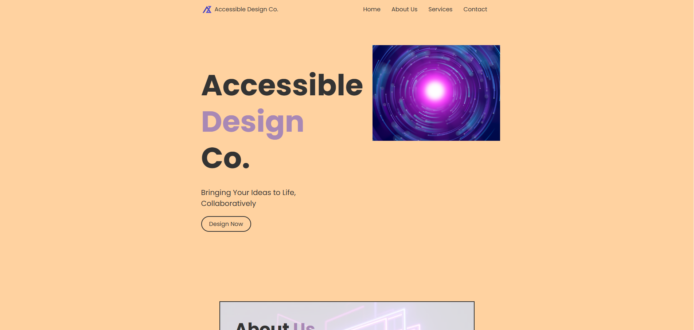
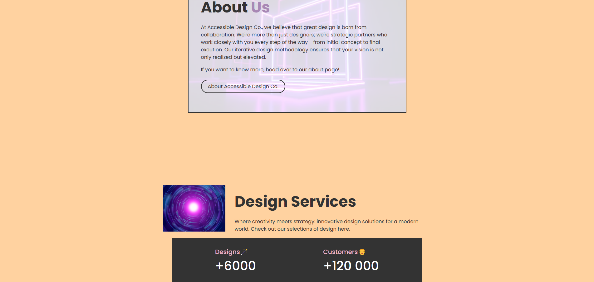
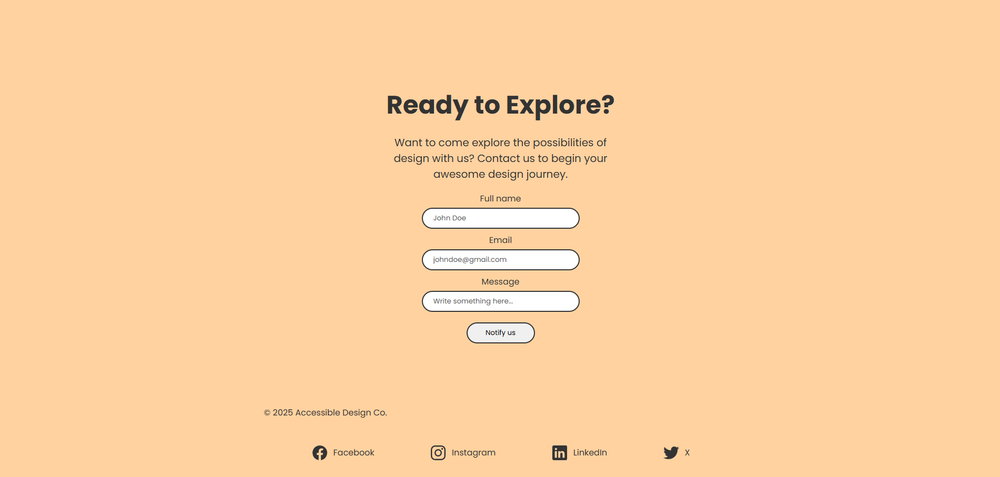

# Responsive Web Page

## Table of Contents

- General
- Illustration
- Features
- Setup
- Usage

## General info

In this assignment, a responsive, multi-sectioned webpage was developed for a fictious company called **Accessible Design Co.**. The assignment demonstrated the ability to create a well-structured, responsive, and accessible web page using the HTML and CSS techniques learned.

## Illustration

## Features

This assignment includes the following features:

### 1. Semantic HTML Structure

- Use of semantic HTML elements (**header**, **main**, **section**, **article**, **footer**, etc.) to create a clear and meaningful structure.
- All content is organized hierarchically using proper headings (**h1**, **h2**, etc.).

### 2. Responsive Design Using Flexbox and Grid

- Use of a responsive navigation bar using Flexbox that adjusts to smaller screen sizes.
- Use of a CSS Grid to create a multi-column layout for the main content area that collapses to a single column on mobile devices.
- Use of media queries to adjust the layout and font sizes for different screen sizes (e.g., 600px and 1024px breakpoints).

### 3. Accessibility Features

- Use of ARIA roles and attributes to enhance the accessibility of interactive elements.
- Use of meaningful **alt** text, and decorative images use **alt=""**.
- Design forms with accessible labels and validation feedback.
- Proper keyboard navigation and focus management for all interactive elements.

### 4. Color Contrast and Visual Design

- Use of a sufficient contrast ratio against the background.
- Use of a CSS to style focus states for interactive elements (e.g., links and buttons) to make them visible when navigated with a keyboard.

## Application

[Click Here to Access Responsive and Accessible Web Page](https://htmlpreview.github.io/?https://github.com/jcwynder/building-a-responsive-and-accessible-web-page/blob/main/index.html)

## Usage

To use Responsive Web Page, follow these steps (using the command line):

1. Open the project in your favorite code editor.
2. Modify the source code to fit your needs.
3. Build the project: **"npm run build"**
4. Start the project: **"npm start"**
5. Use the project as desired.
